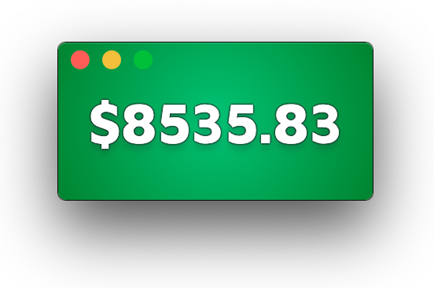

# Bitcoin Price Bug
This is a small "bug" that simply displays the current price of Bitcoin in US dollars. Although intended to be small and unobtrusive on your screen, it is resizable. Future versions will allow some further customization, as well as accomodating other currencies.

Simply open the app and position it anywhere on your screen. It will always stay on top of other windows so it will be visible at all times, perfect for a quick glance.

### Requirements:
- [Node](https://nodejs.org/en/download/) version 10 or above must be installed
- [NVM](https://github.com/nvm-sh/nvm) is recommended to allow multiple versions of Node (Node Version Manager)
- [Yarn](https://nodejs.org/en/download/)

### Set Up the Application
1. [Clone the repo](https://github.com/gotaloha/BitcoinBug)
2. Open **Terminal** or equivalent
3. Navigate into the `BitcoinBug` directory
4. Run the command: `npm install`
5. Run the command: `npm start`

### To Build the Application
1. Open **Terminal** or equivalent
2. Navigate into the `BitcoinBug` directory
3. Run the command: `yarn make`
4. Find the compiled files in the `output` folder
   - The `make` folder contains the zipped package that you can distribute however you wish.
   - The other folder's name will vary depending on the system that you are using. An executable application file and it's package information can be found in this folder.

### Using the Application
1. **Open the App**
2. **Move** the app around the screen by clicking and dragging anywhere on it.
3. **Profit?**
